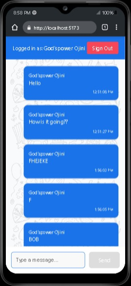

**🗨️ My Chat App 🚀**

Welcome to My Chat App – the coolest chat experience you've been waiting for! 🎉 Whether you're catching up with friends or having deep conversations, this app makes chatting smoother, faster, and more fun! 😎💬

✨ Features

✅ Real-Time Messaging – Say bye to delays, chat in the NOW! ⏳➡️⚡
✅ No More "This message was deleted" – We fixed that annoying WhatsApp-style delete message! 🛠️👀 Now, messages disappear silently when deleted! 🚫✨
✅ Sleek UI/UX – Minimalist, modern, and smooth as butter! 🧈😍
✅ Dark Mode & Light Mode – Because your eyes deserve a break! 🌙☀️✅ Fast & Lightweight – Runs like a dream, even on slower networks! 🚀💨

**🚀 Getting Started**
Clone this repo and install dependencies:

  git clone https://github.com/Gpcode233/my-chat-app.git
  cd my-chat-app
  npm install
  npm run dev

**🌍 Deployment**
We’re LIVE! 🎊 Try it now: my-chat-app-three-teal.vercel.app🔥

**📸 Screenshots**

Here’s a preview of **My Chat App** in action! 🚀  

**👨‍💻 Tech Stack**

Frontend: React + Vite ⚡

Backend: Firebase / Supabase 🔥

Styling: SCSS + TailwindCSS 🎨

**🤝 Contributing**

Got ideas? Found a bug? 🤔 PRs & Issues are always welcome! 🚀

**🎯 Future Updates**
🚧 Voice & Video Calls 📞🎥

🚧AI-Powered Smart Replies 🤖💡

🚧 Custom Themes & Stickers 🎭🎨

❤️ **Support**

If you love My Chat App, give it a ⭐ on GitHub and share it with your friends! 🌍✨

Made with ❤️ by Godspower Ojini 🚀

